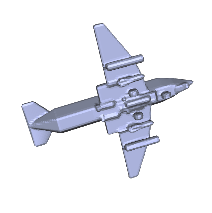

# Marching Cubes 作业报告

## 运行说明

编程环境为`python==3.7`和`numpy==1.21.6`.

将文件如下排列, 运行`python MarchingCube.py`, 结果将存储到`results/`目录下.
```
│  MarchingCube.py
│  models.py
│  tables.py
│
├─data
│      01.sdf
│      02.sdf
```

## 实现说明

**Step 1** 使用`numpy`读入二进制数据为128×128×64的`ndarray`, 存储每个顶点的值.

**Step 2** 遍历每一个grid, 根据其8个顶点的值的符号判断grid与mesh相交的边, 以及面的连接方式. 查询所需的表来自[此处](http://www.paulbourke.net/geometry/polygonise/).

**Step 3** 对每一条相交的边, 确认相应的两个顶点, 通过线性插值求出mesh与这条边相交点的坐标.

**Step 4** 利用**Step 2**中所得的面的连接方式和**Step 3**中所得的交点坐标生成obj文件.

## 实现效果

重建效果如下图所示.

<center class="half">


</center>
