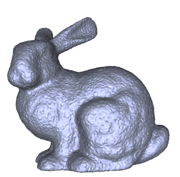
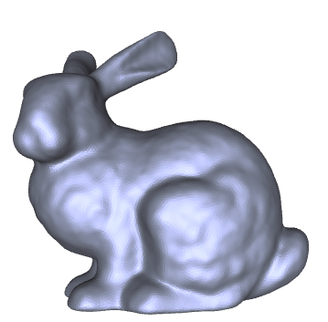

# Mesh Processing 作业报告

本次作业实现了基于[Bilateral Normal Filtering for Mesh Denoising](https://ieeexplore.ieee.org/document/5674028)的网格平滑算法。

## 运行说明

编程环境为`python==3.7`、`numpy==1.21.6`、`openmesh==1.2.1`、`tqdm==4.64.1`.

将文件如下排列, 运行`python smoothing.py`, 结果将存储为`result.obj`.
```
│  smoothing.py
│
├─data
│      smoothing.obj
```

## 实现说明

**Step 1** 计算每一个三角网格的面积$A_i$、重心坐标$c_i$、法向量$n_i$.

**Step 2** 计算$\sigma_c$为所有相邻面重心距离的均值.

**Step 3** 更新面的法向量. 迭代执行
$$
n_i' = K_i\sum_{j\in Neighbour(i)}A_jW_c(||c_i-c_j||)W_s(||n_i-n_j||)n_j
$$
其中
$$
1/K_i = \sum_{j\in Neighbour(i)}A_jW_c(||c_i-c_j||)W_s(||n_i-n_j||) \\
W_c(t) = \exp (-t^2 / 2{\sigma}_c^2) \\
W_s(t) = \exp (-t^2 / 2{\sigma}_s^2)
$$
${\sigma}_s$是超参数, 实验中设定为0.5.

**Step 4** 更新顶点位置. 迭代执行
$$
v_i' = v_i + \cfrac{1}{|Neighbour(i)|}\sum_{j\in Neighbour(i)}n_j(n_j^{T}\cdot (c_j-v_i))
$$

## 实现效果

平滑前后效果如下图所示.



