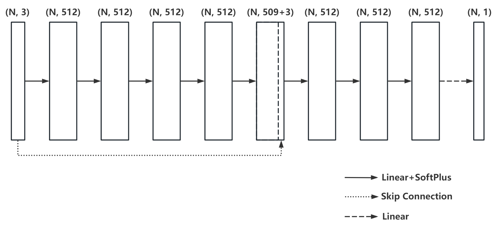

# Reconstruction 作业报告


## 运行说明

将文件如下排列, 运行`python train.py`, 将进行训练并将参数保存为`checkpoint.pth`, 运行`python inference.py`将从`checkpoint.pth`读取模型参数并进行重建.
```
├── gargoyle.xyz
├── checkpoint.pth
├── inference.py
├── model.py
├── train.py
└── utils.py
```

## 实现说明

参考论文[Implicit Geometric Regularization for Learning Shapes](https://arxiv.org/pdf/2002.10099.pdf)

网络结构如下, 为含有8个隐层的MLP加上一个Skip Connection, 将N个三维坐标点映射为相应的SDF值



损失函数

$$
l(\theta) = \cfrac{1}{|I|}\sum_{i\in I}(f(x_i;\theta)+\tau||\nabla_x f(x_i;\theta)-n_i||) + \lambda \mathbb{E}_x (||\nabla_x f(x;\theta)||-1)^2
$$

训练时采用`momentum=0.9`的SGD优化, 初始`lr=0.005`, 全连接层权重初始化方式为geometric initialization, 训练epoch为20000

得到训练好的模型后, 求原来点云的Bounding Box并划分格点, 对每一个格点计算相应的SDF值, 最后采用Marching Cubes算法得到几何表面

## 实现效果

重建结果如下图所示

