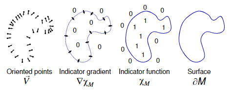
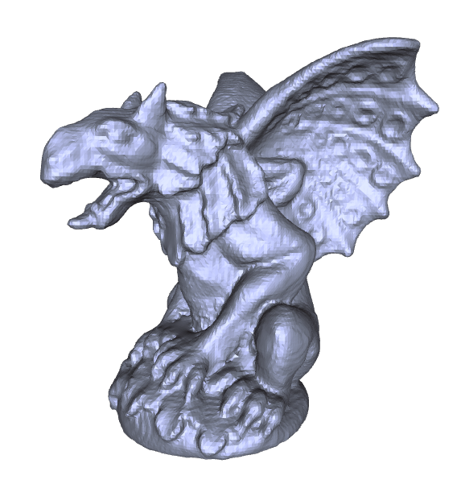
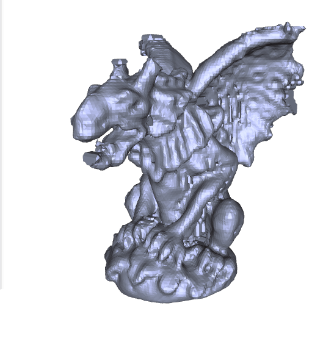
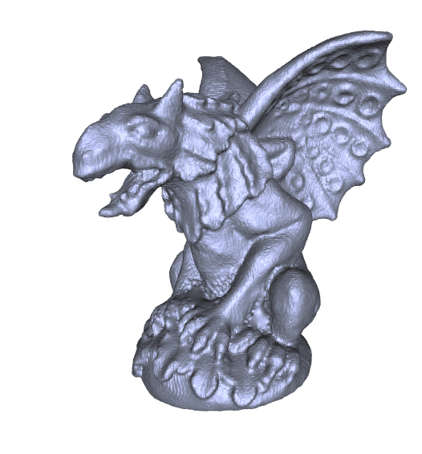
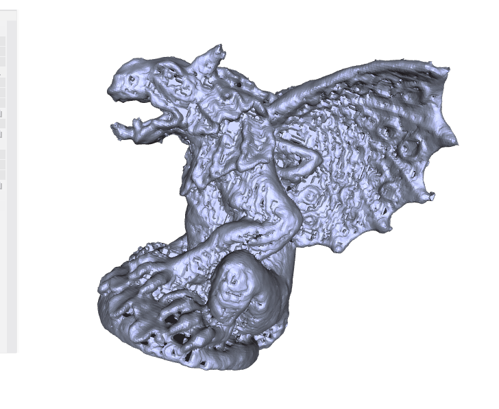

# Poisson Reconstruction 作业报告

本次作业实现了[Poisson重建算法](https://hhoppe.com/poissonrecon.pdf)，给定输入的点云及点的法向，通过解Poisson方程得到隐式曲面，从而重建表面。

## 算法原理

Poisson算法用指示函数$\chi_M$表示隐式曲面，在曲面内部函数值为1，在曲面外部函数值为0。直观上，$\chi_M$的梯度方向与曲面表面法向是一致的，因此只需要重建指示函数的梯度，进而得到指示函数，即可通过Marching Cubes算法提取表面。

然而，指示函数在表面的梯度是无穷大，因此，需要引入一个光滑函数$\tilde{F}$，且可以证明光滑后的指示函数$\tilde{\chi}=\chi*\tilde{F}$的梯度与光滑后的表面法向量场$\vec{V}$相等。因此，只需求解Poisson方程$$
\Delta\tilde{\chi} = \nabla \cdot \vec{V}
$$
即可实现表面重建。

## 无八叉树版本

本次作业中，首先对[已有的开源代码](https://github.com/xucao-42/poisson_surface_reconstruction)进行阅读和修改，实现了不使用八叉树结构优化的Poisson重建，主要目的在于通过代码学习重建的整体流程和部分细节，并且可以用于与八叉树版本的比对。

修改的部分包括重构框架和补全注释细节，各函数接口有简单改动。

## 八叉树版本

基于个人对论文的理解，尝试使用八叉树结构优化重建过程，并对一些实现起来较为繁杂的部分做了简化。

**Step 1** 通过点云构建八叉树，并为结点定义基函数$$F_o(q)\equiv F\left(\dfrac{q-o.c}{o.w}\right)\dfrac{1}{o.w^3}$$
其中
$$F(x, y, z)\equiv (B(x)B(y)B(z))^{*3}, B(t)=\begin{cases}1, & |t|<0.5 \\ 0, & \text{otherwise}\end{cases}$$

因此，由结点的基函数张成的函数空间可以表示为$$
\bold{F} = \left[\begin{matrix}
    F_{o_1}(o_1.c) & F_{o_2}(o_1.c) & \cdots & F_{o_n}(o_1.c) \\
    F_{o_1}(o_2.c) & F_{o_2}(o_2.c) & \cdots & F_{o_n}(o_2.c) \\
    \vdots & \vdots & \ddots & \vdots \\
    F_{o_1}(o_n.c) & F_{o_2}(o_n.c) & \cdots & F_{o_n}(o_n.c) \\
\end{matrix}\right]
$$

**Step 2** 计算节点中心的法向量$$
\vec{V}(o_i) \equiv \sum_{s\in S}\sum_{o\in \mathrm{Ngbr}_D(s)}\alpha_{o,s}F_o(o_i)s.\vec{N}
$$
原论文中$\alpha$取为三线性插值系数，实现时进行了简化，取$\alpha_{o,s} = 1-C||o.c-s||$。

**Step 3** 计算离散的梯度算子$\nabla$和拉普拉斯算子$L$，并在函数空间上做投影得到$\vec{V}_F = \left<\nabla \cdot \vec{V}, \bold{F}\right>$和$L_F=\left<L, \bold{F}\right>$。解$\min_{x}||L_F\cdot x - \vec{V}_F||^2$，得到八叉树节点中心位置的示性函数值。

**Step 4** 等值面提取。原论文中等值面的阈值设置为采样点的示性函数的均值，这应该需要利用节点的函数值进行插值计算。实现中进行了简化，直接选取所有内部有采样点的叶子结点的函数值求均值得到等值面。

**Step 5** 重建表面。原论文采用了针对八叉树改进过的Marching Cubes算法，实现时同样也做了简化，仍然使用基于体素的Marching Cubes。也因此，在不具有相同尺寸叶节点相邻的位置将可能出现重建表面非水密的情况，随分辨率提高这种现象将表现得愈加明显。

## 结果与分析

在本地CPU上运行，采用128\*128\*128的体素分辨率进行gargoyle的重建，两种版本的时间对比如下

| 分辨率 | 时间     | 无八叉树     | 八叉树     |
| :--------: | :--------: | :--------: | :--------: |
| 64 | 构建方程 | ~0.5s | ~3.5min |
| 64 | 解方程 | ~3s | <0.1s |
| 128 | 构建方程 | ~2.5s | ~15min |
| 128 | 解方程 | ~35s | <0.5s |
| 256 | 构建方程 | ~18s | ~1h |
| 256 | 解方程 | ~400s | ~1s |

从构建方程用时来看，表中数据显示八叉树版本用时远超无八叉树的版本，其主要原因在于八叉树版本所使用的数据结构为纯Python的手动实现，并未进行过优化或加速，因此在构建方程时所需大量使用的寻找相邻节点的操作占用了大量时间；而无八叉树的版本在构建方程时使用的numpy和scipy等库具有很强大的加速效果。

而从解方程用时可以看出，八叉树的版本效率远高于无八叉树的版本，这表明八叉树能够十分显著地降低方程的复杂程度。

此外，随着分辨率翻倍，无八叉树版本的用时会变为原来的8\~10倍左右，而八叉树版本则只变为4\~5倍，这也说明在数据结构上各操作的实现得到优化后，八叉树能够在高精度表面重建中节省大量的时间与空间。

以下是重建结果。

不使用八叉树，分辨率128。

使用八叉树，分辨率128，在表面较为复杂的位置与不使用八叉树的效果相近，但在相对平滑的位置则易受到未改进Marching Cubes算法的影响而产生噪声、空洞等情况。

不使用八叉树，分辨率256。

使用八叉树，分辨率256，可以看出不加以改进的Marching Cubes对八叉树结构表面重建的水密性有很大的影响。
